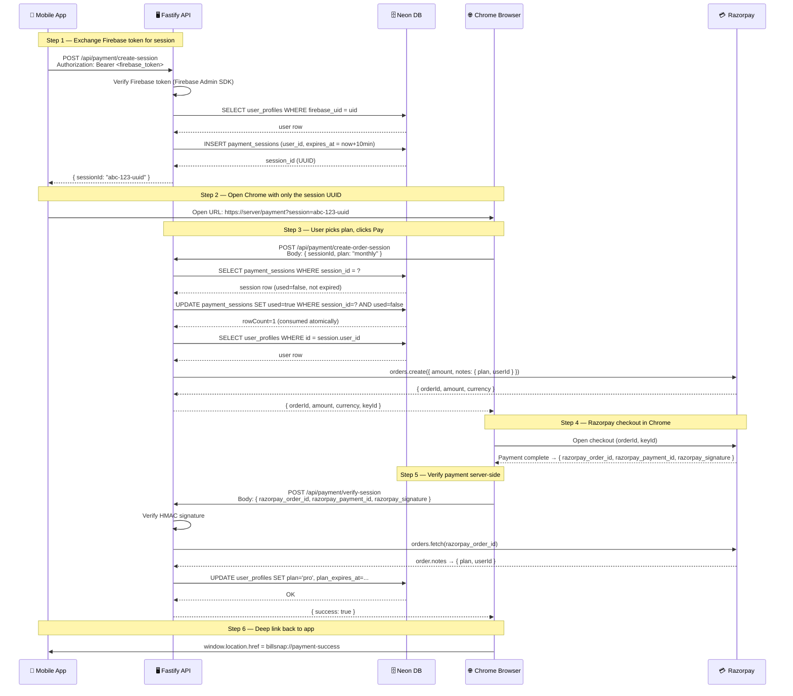

# BillSnap Payment Flow — Chrome Redirect + Deep Link

> **Quick reference** — open this in VS Code Preview (`Cmd+Shift+V`) to see the diagrams rendered.

---

## Why This Architecture?

| Old (WebView) | New (Chrome Redirect) |
|---|---|
| App opens WebView | App opens Chrome (external) |
| Firebase token sent via `postMessage` | Firebase token **never** leaves the app |
| Token visible in JS bridge | Only a one-time UUID in the URL |
| Razorpay embedded in WebView | Razorpay runs in full Chrome |

The core insight: **the Firebase token is exchanged for a disposable session UUID server-side. Only the UUID travels in the URL — it's worthless after one use.**

---

## Mermaid Sequence Diagram

> Renders in VS Code Preview, GitHub, and Notion.



---

## ASCII Flow (for LinkedIn / Slides)

```
┌─────────────────────────────────────────────────────────────────────┐
│              BillSnap — Secure Payment Flow                         │
│              Chrome Redirect + Deep Link Architecture               │
└─────────────────────────────────────────────────────────────────────┘

  📱 MOBILE APP                🖥️ FASTIFY API              🗄️ NEON DB
  ─────────────                ──────────────              ──────────
       │                              │                         │
       │  POST /api/payment/          │                         │
       │  create-session              │                         │
       │  Authorization: Bearer       │                         │
       │  <firebase_token>            │                         │
       │ ────────────────────────────>│                         │
       │                              │  verify token           │
       │                              │  lookup user            │
       │                              │ ───────────────────────>│
       │                              │<─ ─ ─ ─ ─ ─ ─ ─ ─ ─ ─ ─│
       │                              │  INSERT session         │
       │                              │  (expires in 10 min)    │
       │                              │ ───────────────────────>│
       │  { sessionId: "uuid" }       │                         │
       │<─ ─ ─ ─ ─ ─ ─ ─ ─ ─ ─ ─ ─ ─ │                         │
       │                              │                         │
       │  🔑 Token stayed in header.                            │
       │     Only UUID in the URL!                              │
       │                              │                         │
  ─────┼──────────────────────────────┼─────────────────────────┼─────
       │                              │                         │
  🌐 CHROME BROWSER            🖥️ FASTIFY API              💳 RAZORPAY
  ────────────────             ──────────────              ──────────
       │                              │                         │
       │  User opens:                 │                         │
       │  /payment?session=uuid       │                         │
       │                              │                         │
       │  POST /api/payment/          │                         │
       │  create-order-session        │                         │
       │  { sessionId, plan }         │                         │
       │  (no token!)                 │                         │
       │ ────────────────────────────>│                         │
       │                              │  validate session       │
       │                              │  mark used=true         │
       │                              │  (atomic, one-time)     │
       │                              │  create order           │
       │                              │ ───────────────────────>│
       │  { orderId, keyId }          │<─ ─ ─ ─ ─ ─ ─ ─ ─ ─ ─ ─│
       │<─ ─ ─ ─ ─ ─ ─ ─ ─ ─ ─ ─ ─ ─ │                         │
       │                              │                         │
       │  Razorpay checkout opens ──────────────────────────────│
       │  User pays                   │                         │
       │  ←── payment response ────────────────────────────────│
       │                              │                         │
       │  POST /api/payment/          │                         │
       │  verify-session              │                         │
       │  { order_id, payment_id,     │                         │
       │    signature }               │                         │
       │ ────────────────────────────>│                         │
       │                              │  verify HMAC signature  │
       │                              │  fetch order → userId   │
       │                              │  upgrade plan in DB     │
       │  { success: true }           │                         │
       │<─ ─ ─ ─ ─ ─ ─ ─ ─ ─ ─ ─ ─ ─ │                         │
       │                              │                         │
       │  window.location.href =      │                         │
       │  billsnap://payment-success  │                         │
       │                              │                         │
  ─────┼──────────────────────────────┼─────────────────────────┼─────
       │                              │                         │
  📱 APP receives deep link and shows success screen
```

---

## API Reference

### `POST /api/payment/create-session`
**Called by:** Mobile app
**Auth:** Firebase Bearer token (required)
**Purpose:** Exchange token for a safe, one-time session UUID

```
Request:  Authorization: Bearer <firebase_token>
Response: { sessionId: "550e8400-e29b-41d4-a716-446655440000" }
```

---

### `POST /api/payment/create-order-session`
**Called by:** Chrome pricing page
**Auth:** None (session validated internally)
**Purpose:** Consume session, create Razorpay order

```
Request:  { sessionId: "uuid", plan: "monthly" | "yearly" }
Response: { orderId, amount, currency, keyId }

Errors:
  404 → Session not found
  410 → Session expired
  410 → Session already used
  400 → Invalid plan
```

---

### `POST /api/payment/verify-session`
**Called by:** Chrome pricing page (after Razorpay success)
**Auth:** None (identity proved via Razorpay HMAC + order notes)
**Purpose:** Verify payment, upgrade user to Pro

```
Request:  { razorpay_order_id, razorpay_payment_id, razorpay_signature }
Response: { success: true, plan: "pro", expiresAt: "2027-03-09T..." }

Errors:
  400 → Payment verification failed (bad signature)
  400 → Invalid order notes
```

---

### `GET /api/payment/status`
**Called by:** Mobile app
**Auth:** Firebase Bearer token (required)
**Purpose:** Check current plan

```
Response: { plan: "free" | "pro", planExpiresAt: "..." }
```

---

## Security Checklist

- [x] Firebase token only travels in `Authorization` header — never in any URL
- [x] SessionId is a one-time UUID — marked `used=true` atomically before order creation
- [x] Session expires in 10 minutes
- [x] `userId` is never trusted from the browser — read from Razorpay `order.notes` (server-authored)
- [x] Razorpay HMAC signature verified before any DB update
- [x] `UPDATE ... WHERE used=false` prevents race condition double-spend

---

## What Happens When User Dismisses Razorpay?

```
User clicks X on Razorpay checkout
    → modal.ondismiss fires
    → window.location.href = 'billsnap://payment-cancelled'
    → App receives deep link, shows pricing screen again
    → App calls POST /api/payment/create-session again (new UUID)
    → App opens Chrome with fresh session
```

The session is already consumed at `create-order-session` time, so the app must generate a fresh one. This is by design — prevents session replay.

---

## Database Schema

```sql
-- Existing table (no changes needed)
user_profiles (
  id UUID PRIMARY KEY,
  firebase_uid TEXT UNIQUE,
  plan TEXT DEFAULT 'free',
  plan_expires_at TIMESTAMPTZ,
  razorpay_subscription_id TEXT,
  ...
)

-- New table (run in Neon console)
payment_sessions (
  session_id UUID PRIMARY KEY DEFAULT gen_random_uuid(),
  user_id    UUID NOT NULL REFERENCES user_profiles(id) ON DELETE CASCADE,
  expires_at TIMESTAMPTZ NOT NULL,
  used       BOOLEAN NOT NULL DEFAULT false,
  created_at TIMESTAMPTZ NOT NULL DEFAULT NOW()
)
```
